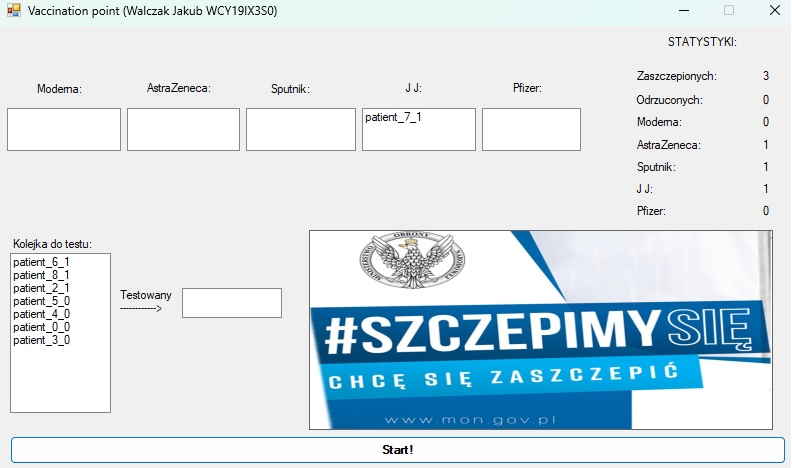

# Vaccination_point
Multithreading simulation of vaccination against COVID-19 point.

## Overview

This application is a simulation of a vaccination point where patients can visit to get vaccinated against COVID-19. The application uses multiple threads to handle patient visits, testing, and vaccination processes. Patients arrive at the vaccination point, undergo COVID-19 testing, and are then vaccinated based on their preferred vaccine preparation type and priority. The application also includes a graphical user interface (UI) to display real-time updates about the vaccination process.

## Functionality

The application consists of several classes that handle different aspects of the vaccination process:

1. `Logic` Class: This class contains methods related to patient visits, testing, and handling counters for statistics.

2. `Threads` Class: This class manages the creation and synchronization of threads for simulating patient visits and updating the UI.

3. `Patient` Class: This class represents a patient with a unique ID, preferred vaccine preparation type, and priority for vaccination.

4. `Vaccination_point` Class: This class manages the queues for registration, testing, and vaccination, and also handles the vaccination process based on the patient's preferred preparation type and priority.

5. `mainForm` Class (UI): The graphical user interface class, where various listboxes and labels are used to display real-time information about the vaccination process.

## How the Application Works

1. The application starts with a graphical user interface (mainForm) that provides buttons to initiate patient visits and displays real-time updates about the vaccination process.

2. The button "Create Patient Threads" (`Button1_Click` method) is used to start the simulation. When clicked, it creates a specified number of threads, each representing a patient visit (`CreateThreads` method in `Threads` class).

3. Each patient visit thread (`PatientVisit` method in `Logic` class) creates a new patient with a random preferred vaccine preparation type (`prep`) and a random priority (`patientsPriority`).

4. The patient is then added to the registration queue (`registration_queue`) and testing buffer (`testing_buffer`) in the `Vaccination_point` class.

5. The patient undergoes a COVID-19 test by calling the `TestPatient` method in the `Logic` class.

6. The test result is randomly generated (0 for negative, 1 for positive).

7. If the test result is positive, the patient is removed from the testing buffer, and the visit ends.

8. If the test result is negative, the patient is added to the corresponding vaccine preparation queue (`moderna_queue`, `astra_queue`, etc.) based on their preferred preparation type.

9. The patient is then vaccinated based on their priority and the vaccine preparation queue they are in. The vaccination process takes 3 seconds.

10. After vaccination, the patient is removed from the corresponding vaccine preparation queue.

11. The counters for various statistics, such as the number of vaccinated patients (`vaccinated_counter`) and the number of positive tests (`positive_counter`), are updated and displayed in real-time in the graphical user interface.

12. The UI updates are handled by separate threads (`Listbox_X_actualization` methods in `Threads` class), which periodically refresh the listboxes and labels with the latest information.

## UI design

